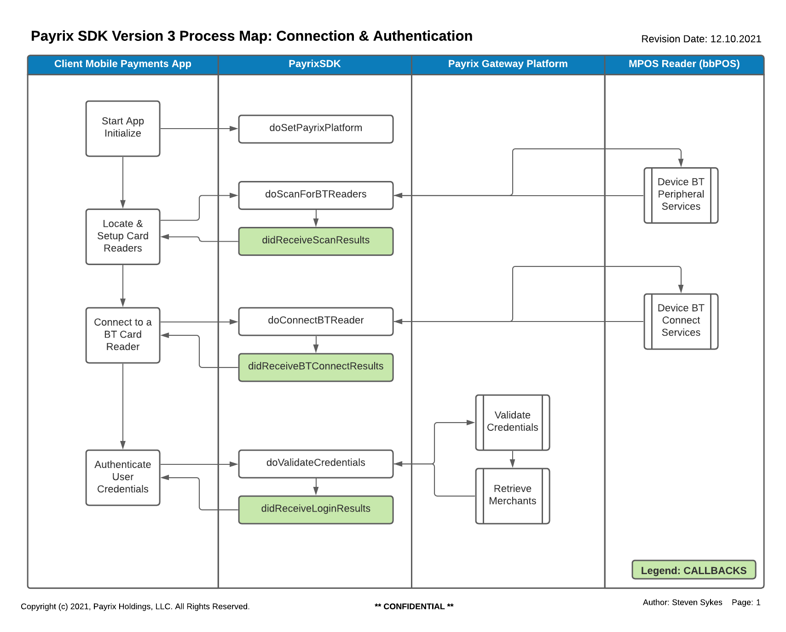
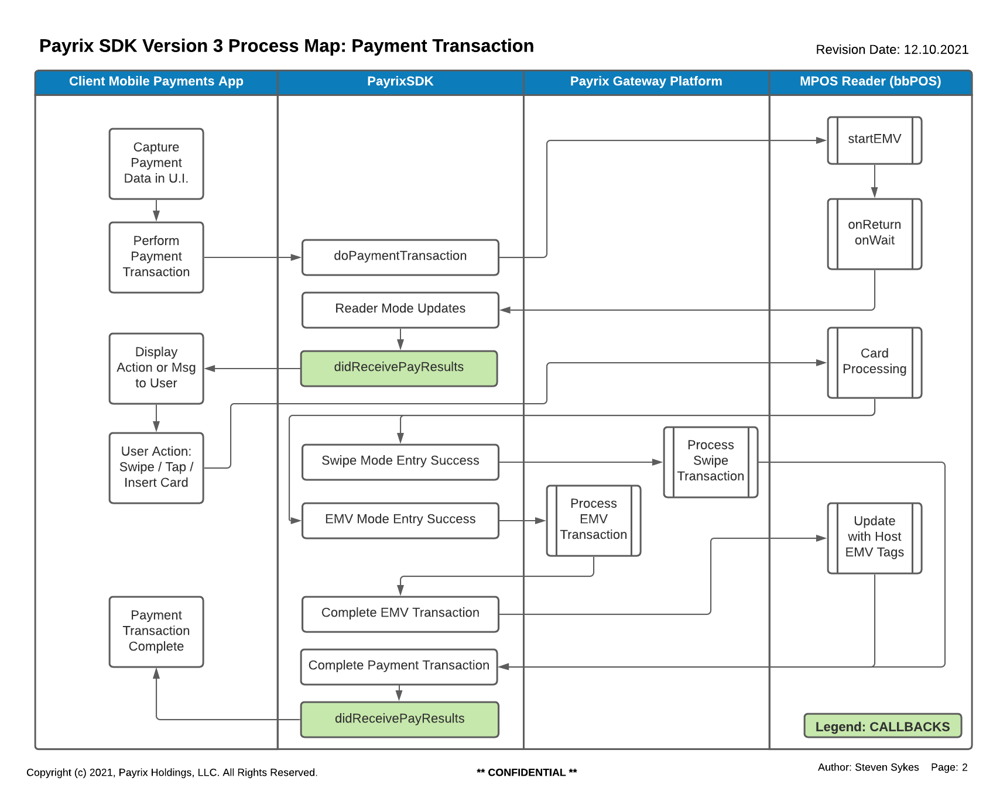
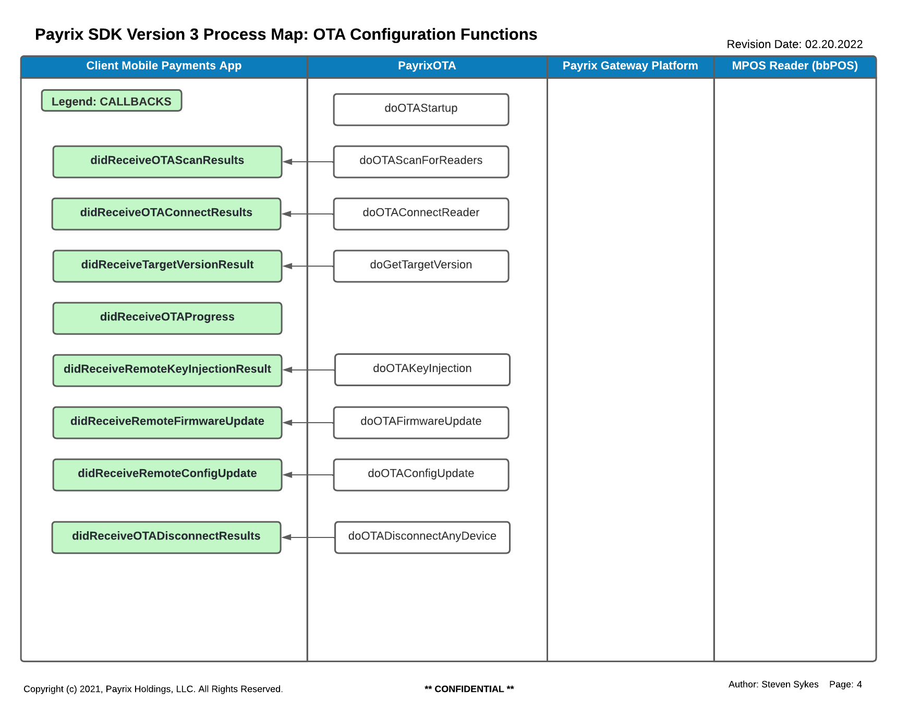

# Payrix iOS SDK Version 3.0

## Release Note Summary:
- Version 3.0.0 (EMV Certified)
  This release of the Payrix iOS SDK is completely restructured under a single framework that give the user full access to all of the services provided by previous SDK versions.
  
## Integrating the PayrixSDK into your Payment App

1.  Download this Payrix Mobile iOS SDK Version 3.0 folder.

2.  After you unzip the download file you will find 3 files of interest:
    a.  This Developer’s Guide for iOS.
    b.  The PayrixSDK.framework file
    c.  The PayrixSDK3Demo folder

3.  Adding the Payrix SDK to your App:
    a.  Within your project folder there should be a subfolder named:  Frameworks.  If it does not exist, then you can create it.
    b.  Next drag the PayrixSDK.framework file to the Frameworks folder.  Select Copy on the popup.
    c.  Next with the Project level selected, select General in the main pane.
    d.  Scroll down to the section titled “Frameworks, Libraries, and Embedded Content”
    e.  You should see PayrixSDK.framework listed.  Under the caption “Embed”, use the pulldown to select “Embed & Sign”

4.  You are now ready to use the new PayrixSDK in your App.

## SDK Process Map of SDK Functions (Methods and Callbacks)

